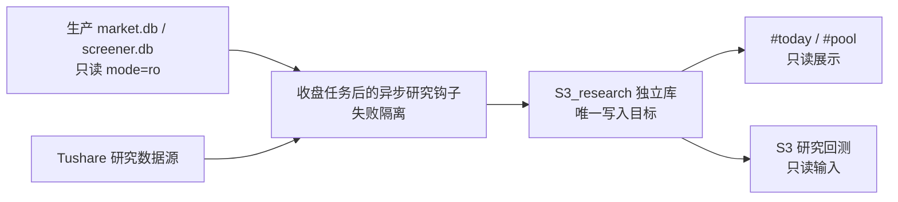

# S3 集群顺势研究：数据、展示与回测设计

- 状态：设计已批准，参数与选择纪律已冻结
- 日期：2026-07-28
- 实施分支一：`codex/s3-stage1-data-clusters`
- 实施分支二：`codex/s3-stage2-backtest`
- 原始需求：
  - `S3集群顺势中线策略-预声明稿.md`
  - `Codex任务指令-S3策略数据与回测.md`

## 1. 目标

在不改变现有 S2 策略、生产收盘任务和交易行为的前提下，新增一套个人研究能力：

1. 建立独立的 `S3_research` 数据库，统一保存 S3 所需的历史原始数据、派生数据、审计结果和任务记录。
2. 在现有界面只读展示市场宽度、S3 研究闸门和活跃申万二级集群。
3. 按预声明规则完成 2015—2025 年 S3 回测、81 组样本内参数扫描、锁定样本外验证和同口径 S2 对照。
4. 形成可复核的数据定义清单、交易明细、局限性和验收证据。

内部标识统一使用 `s3_cluster`，界面完整名称统一使用“S3 集群顺势研究”，避免与历史“S3 防守慢牛”混淆。

## 2. 不做什么

- 不修改 `market.db`、`screener.db` 或其中任何生产数据。
- 不修改现有 S2 规则、风险控制、交易记录、选股结果和生产信号。
- 不把 S3 接入实盘买卖或自动交易。
- 不把 `pool.industry` 的单层行业名映射或混入 S3 计算。
- 不为缺失字段编造值，不硬编码演示股票、集群或回测结果。
- 不在主分支开发，不合并两个实施分支到 `main`。
- 不在回测结果出来后修改冻结的选参规则、追加参数组合或重跑调参。
- 不新增 npm 或 pip 依赖。

## 3. 总体架构



数据只能从生产库流向研究库，不能反向写回。界面和回测只读 `S3_research`。这条边界由连接方式、模块依赖、测试和差异审计共同保证。

采用物化旁路方案：收盘后异步生成派生表，页面直接读取。拒绝页面实时重算，也拒绝扩展生产数据库。

## 4. 生产隔离与研究钩子

研究钩子挂在现有收盘编排完成之后，但不进入主收盘任务的成功条件：

1. 主任务只发起研究子任务，不等待它完成。
2. 单飞锁保证同一交易日、同一版本只有一个实例运行。
3. 最外层和任务内部都捕获异常，只写研究日志，绝不向上抛出。
4. 生产库连接必须使用 SQLite URI `mode=ro`。
5. 研究任务只能写 `S3_research`。
6. 每批数据在事务内写入暂存区，完成完整性校验后原子替换。
7. 空数据、残缺数据、日期回退或异常波动都不得覆盖上一份有效快照。
8. 任务状态、输入范围、行数、耗时和错误写入 `job_runs`。
9. 钩子不生成实盘动作，不改变 S2 的时序、返回值、异常和日志语义。

验收时注入下载失败、SQLite 写失败和派生计算异常，证明主收盘任务不等待、不抛错、不产生半成品。

用户已批准一个窄例外：允许在现有收盘编排完成后增加这个失败隔离、下游只读的启动点。该启动点是原“不得改变收盘任务行为”边界的唯一例外。不得修改 `run_eod_scan`、现有数据处理步骤或定时条件；除启动研究子任务外，不得在生产编排文件中加入 S3 逻辑。

## 5. 数据定义

### 5.1 生产库只读数据

| 表 | 字段 | 区间 | 用途 |
|---|---|---:|---|
| `market_daily` | `trade_date, ts_code, open, high, low, close, amount` | 2015-01-05 至今 | 行情、成交额、ATR、成交模拟、停牌判断 |
| `adj_factors` | `date, code, factor` | 2015-01-05 至今 | 后复权高低点、RS、ATR |
| `index_daily` | 沪深 300 `000300.SH` 日线 | 2015-01-05 至今 | 基准收益、MA60 仓位上限 |
| `universe_snap` | `quarter, code` | 2014Q4 至今 | 历史股票域及同区间 S2 对照 |

生产行情的重复字段不复制进研究库。回测读取生产库时仍保持只读。

### 5.2 仅写入 `S3_research` 的外部数据

| 来源接口 | 字段 | 区间 | 用途 |
|---|---|---:|---|
| Tushare `daily` | `trade_date, ts_code, open, high, low, close, amount, vol` | 2013-12-01—2014-12-31 | 2015 指标暖窗；不产生信号和交易 |
| Tushare `adj_factor` | `trade_date, ts_code, adj_factor` | 2013-12-01—2014-12-31 | 暖窗后复权 |
| Tushare `daily.vol` | `trade_date, ts_code, vol` | 2015-01-01—2025-12-31 | 深回调放量和同口径 S2 对照 |
| Tushare `index_classify` | `index_code, industry_code, industry_name, parent_code, is_pub, src` | 申万 2021 二级目录 | 唯一行业分类口径 |
| Tushare `index_member_all` | `l2_code, l2_name, ts_code, in_date, out_date, is_new` | 可得全历史至今 | 信号日时点成分股 |
| Tushare `sw_daily` | `ts_code, trade_date, open, high, low, close` | 2014-01-01 至今 | 申万二级指数 60 日新高 |
| Tushare `stock_basic` | `ts_code, list_date, delist_date, list_status` | 全量 | 上市满一年过滤 |
| Tushare `namechange` | `ts_code, name, start_date, end_date, ann_date` | 全历史 | 2016 年前 ST 区间辅助 |
| Tushare `stock_st` | `ts_code, name, trade_date, type, type_name` | 2016-01-01—2025-12-31 | ST 时点过滤 |
| Tushare年度财务 | `ts_code, f_ann_date, end_date, report_type, revenue, n_income, update_flag` | 2012—2024 年报 | 质地底线 |

数据源文档：

- `index_classify`：<https://tushare.pro/document/2?doc_id=181>
- `index_member_all`：<https://tushare.pro/document/2?doc_id=335>
- `sw_daily`：<https://tushare.pro/document/2?doc_id=327>
- `stock_st`：<https://tushare.pro/document/2?doc_id=397>
- `stock_basic`：<https://tushare.pro/document/1?doc_id=25>

申万二级数据探测已确认：目录有 134 个二级行业；`sw_daily` 可访问；历史成员接口能返回退出成员和 `out_date`。正式入库后仍须在 `source_audit` 记录实际覆盖率。如果成分历史不完整，报告必须单列“幸存者偏差”，不能静默带过。

### 5.3 财务时点规则

信号日只能看见 `f_ann_date <= 信号日` 的记录。系统选择当时最新的已公开年报，并与上一年度已公开年报比较：

- 净利润为负且营业收入同比下降时，触发质地底线剔除。
- 其他情况不因单一财务指标被剔除。
- 缺失字段不补值，标记为不完整并统计缺失率。

回测报告必须写明“严格按实际公告日取上一份已公开年报”，避免未来函数。

### 5.4 暖窗纪律

2013-12-01—2014-12-31 的数据只计算 2015 年初的 250 日新高/新低、120 日 RS 和 20 日 ATR：

- 暖窗内不产生信号，不产生交易，不进入收益统计。
- 报告记录来源、区间、覆盖率。
- 与生产行情库重叠日期抽样比较开高低收、成交额和复权因子，并报告一致率。

### 5.5 研究库派生表

| 表 | 主要内容 |
|---|---|
| `breadth_daily` | `trade_date, nh250, nl250, net, net_5d, confirm_nonnegative_days, gate_open` |
| `cluster_daily` | `trade_date, l2_code, l2_name, hit_count_10d, industry_nh60, inactive_streak, active` |
| `cluster_members_daily` | 日期、二级行业、时点成分股、个股是否命中 250 日新高 |
| `source_audit` | 来源、字段、实际区间、行数、缺失率、覆盖率、重叠一致性 |
| `job_runs` | 任务版本、开始/结束、输入日期、状态、错误、发布批次 |

原始外部数据按来源单独建表。所有记录保留来源和更新时间。派生表带公式版本，保证同一输入可复算。

## 6. 阶段一计算规则

### 6.1 价格和有效窗口

- 后复权价格统一为 `原始价格 × adj_factor`。
- 一只股票至少有 250 个有效交易日，才能参与当日 NH250/NL250 统计。
- NH250/NL250 使用包含当日的 250 个有效交易日滚动最高/最低价。
- 股票域、上市年限、ST、退市和行业成员关系都按信号日时点判断。

### 6.2 市场宽度闸门

每日净值为 `NH250 - NL250`，五日净值为最近五个交易日每日净值之和：

- 当前五日净值大于 0，且最近 3 个交易日每日净值均不小于 0，闸门开启。
- 当前五日净值小于 0，闸门关闭。
- 当前五日净值等于 0，沿用上一状态。
- 没有上一状态时，默认关闭。

### 6.3 二级行业集群

在最近 10 个交易日内，满足任一条件即进入活跃状态：

1. 至少 `N` 只信号日时点成分股命中 NH250；
2. 申万二级行业指数命中 60 日新高。

连续 20 个交易日两项都不满足，集群转为非活跃。阶段一默认 `N=3`，但物化数据必须足以在阶段二扫描 `N=2/3/4`。

若某行业指数未发布，只使用成分股条件，并记录指数缺失；不允许替换成另一套行业分类。

## 7. 界面设计

界面只读现有接口绑定的真实数据，不增加写操作。

### 7.1 `#today`

现有生产闸门卡保持不变。在旁边新增“S3 观察指标 · 不影响交易”卡，展示：

- 研究闸门开/关；
- NH250、NL250；
- 五日净值；
- 最近三日确认进度，例如 `3/3`；
- 数据日期。

没有有效研究快照时显示明确空状态，不显示占位数字。

### 7.2 `#pool`

先展示只读“活跃集群”：

- 申万二级行业名称；
- 最近 10 日命中数，例如 `5/3`；
- 行业指数是否命中 60 日新高；
- 连续活跃天数；
- 真实时点成员明细。

现有股票池状态分组继续保留在下方。旧 `/pool` 页面一行不改；入口只放在“我的 → 工程模式”。不渲染没有数据层字段的 `2×ATR` 或“板块联动”，也不新增计算补位。

桌面和手机都要验证真实数据态与空状态。

## 8. 阶段二策略与成交规则

### 8.1 个股资格

个股必须属于信号日的活跃集群，并同时满足：

1. 20 日日均成交额不低于 3 亿元；
2. 收盘创 250 日新高，或距 250 日新高不超过 5%；
3. 120 日涨幅位于全市场前 15%；
4. 非 ST、上市满一年，且未触发“最新已公开年报净利润为负且营收同比下降”的质地底线。

集群外的单独强势股只进入 B 观察池，不开仓；所属申万二级行业激活后才重新判断资格。所有合格信号全量进入机械排序，AI 不评分、不否决、不拦截。七因子只允许作为报告中的回代研究栏目。

### 8.2 平台、入场和排序

- 平台价沿用现有 S2 定义：此前 250 日最高收盘价线。
- 浅回踩：捕获后确实发生回踩，收盘价位于 `[平台价, 平台价 + 2.5×ATR20]`，下一可交易日开盘成交。
- 深回调：捕获后峰值至低点回撤 `4—7×ATR20`，随后成交量不低于 `1.5×20日均量` 并重新站上平台，下一可交易日开盘成交。
- 收盘高于 `平台价 + 2.5×ATR20` 时禁止追高。
- RS 得分为 120 日涨幅的全市场分位，集群强度得分为近期新高家数的行业横截面分位。
- 首次捕获得分：首次满足资格为 100，否则为 0。
- 平台贴近得分：平台价处为 100，至 `平台价 + 2.5×ATR20` 线性降为 0。
- 同日候选按总分降序，在现金、总仓、单票和行业上限内依次成交。

三组权重固定为：

| 名称 | RS 分位 | 集群强度分位 | 首次捕获 | 平台贴近 |
|---|---:|---:|---:|---:|
| 基准 | 50 | 30 | 10 | 10 |
| RS 偏重 | 60 | 20 | 10 | 10 |
| 集群偏重 | 40 | 40 | 10 | 10 |

### 8.3 风险、退出和摩擦

- 初始资金 50 万元。
- 每笔风险为账户权益的 1%。
- 初始止损为 `平台价 - 参数倍数×ATR20`；股数按 `账户权益×1% ÷（买价-初始止损）` 计算。
- 单票仓位不超过 30%，总仓位不超过 60%，单一申万二级行业不超过 30%。
- 沪深 300 位于 MA60 下方时，总仓位上限降为 30%。
- 账户回撤达到 8% 时停止新开仓，沿用现有人工恢复纪律。
- 收盘确认信号，下一可交易日开盘成交。
- 费用、涨跌停、停牌和不可成交规则调用现有回测帮助函数。
- 主吊灯线为持有期最高收盘价减参数倍数×ATR20，只上移、不下移。
- 达到 1R 后，止损上移至盈亏平衡。
- 达到 2.5R 后卖出三分之一，剩余仓位采用 4×ATR 吊灯退出。

## 9. 参数扫描与冻结纪律

样本内只扫描下列 `3×3×3×3=81` 组：

- 集群命中数：`2 / 3 / 4`
- 初始止损：`2 / 2.5 / 3 × ATR`
- 吊灯退出：`2.5 / 3 / 3.5 × ATR`
- 权重：基准 / RS 偏重 / 集群偏重

时间切分：

- 样本内：2015-01-01—2021-12-31
- 样本外：2022-01-01—2025-12-31

预声明基准为：集群命中数 `3`、初始止损 `2×ATR`、吊灯退出 `3×ATR`、基准权重。

样本内选择规则自 2026-07-28 起冻结，顺序不可改变：

1. 先过滤最大回撤不小于 25% 的组合，只保留最大回撤小于 25% 的组合。
2. 在保留组合中选择年化超额收益最高者。
3. 年化超额收益并列时，选择最大回撤较小者。
4. 没有组合通过最大回撤过滤时，判定调参失败；样本外只运行预声明基准。

回测结果产生后，不得以任何理由修改这套选择规则、追加参数组合或重跑调参。任何改动必须另立一份带日期的新预声明，不能覆盖本次结果。

2015—2025 共 11 个自然年。“正收益年份过半”按至少 6 年执行。

## 10. 回测报告

报告必须包含原任务指定的八项：

1. 2015—2025 全量结果：年化收益、对沪深 300 的年化超额、最大回撤、胜率、盈亏比、单笔期望、总交易笔数和年均交易笔数；
2. 2015、2018、2022 三个崩塌年份各自的收益、回撤和交易行为；
3. 2015—2025 共 11 个自然年的逐年统计表；
4. 同区间、同费用、同成交规则和同股票域的 S2 平行对照；
5. 81 组参数敏感性结果，每组输出单笔期望和最大回撤，并判断是否存在孤岛最优；
6. 2015—2021 样本内调参和 2022—2025 锁定样本外验证；
7. 信号分布：每年信号数、市况分布、信号后 60/120 日收益分布；
8. 过闸结论：逐项判断年化超额大于 8%、最大回撤小于 25%、正收益年份至少 6 年，以及相对 S2“期望更高，或期望相同但回撤更小”。

逐笔交易明细和至少 5 笔人工复核样本属于验收附件，不能用来替代八项中的任何一项。

报告必须单列：

- 财务数据按实际公告日取当时已公开年报；
- 2016 年前 ST 数据用曾用名区间辅助，以及它对 2015 年质地底线剔除的可能影响；
- 成分股历史不完整时的幸存者偏差；
- 暖窗来源、区间、覆盖率及与生产行情重叠日期的一致性；
- `daily.vol` 的覆盖率和重叠抽查；
- 财务缺失率；
- 冻结的参数选择规则、81 组边界和禁止事后重跑的纪律；
- 最优点是否位于稳定参数岛，不能只展示单一最优值。

## 11. 分支和交付边界

### 分支一：数据与集群

`codex/s3-stage1-data-clusters` 从当前 `main` 建立，只包含：

- 研究库模式和迁移；
- 外部数据采集、审计和续传；
- 只读生产数据适配；
- 失败隔离的异步钩子；
- 宽度和集群物化；
- 只读接口及批准的 `#today`、`#pool` 展示；
- 阶段一测试、审计结果和文档。

### 分支二：回测

阶段一验收后，从分支一的已接受提交建立 `codex/s3-stage2-backtest`，只新增：

- S3 回测引擎；
- 81 组冻结扫描；
- 样本内选择和锁定样本外执行；
- S2 同口径对照；
- 报告、交易明细和复核证据。

两个分支都不合并 `main`，也不切换生产部署。最终提交前列出相对基线的文件差异，证明没有意外修改现有策略、风控和生产数据管道。

## 12. 验收标准

### 阶段一

- 人工复算 3 个历史交易日的 NH250/NL250。
- 人工验证 2 个申万二级集群的激活和退出。
- 验证暖窗覆盖率、生产重叠一致性和成分历史覆盖。
- 注入异常，证明生产收盘任务不等待、不抛错、研究库不发布坏批次。
- 验证重复运行幂等、断点续传和单飞锁。
- 验证页面真实数据态、空状态、桌面和手机布局。
- 验证 S3 全链路没有读取 `pool.industry`。

### 阶段二

- 恰好执行并保存 81 组样本内组合，不多不少。
- 机器测试冻结选择规则，包括无组合过线时回退预声明基准。
- 样本外只运行一次锁定参数，不把结果反馈到选择过程。
- S2 对照使用相同区间、费用、成交和股票域。
- 输出全部报告章节、年度结果、交易明细和 5 笔人工复核。
- 检查研究代码不能写生产库，也不进入生产交易链路。

### 仓库回归

每个实施分支完成时运行：

```bash
.venv/bin/python test_rules.py
.venv/bin/python test_rules_mid.py
.venv/bin/python test_web.py
.venv/bin/python test_regime.py
```

同时运行新增的 S3 单元、集成、数据库只读保护和回测确定性测试。只有命令退出码为 0、差异审计通过，才能声明该阶段完成。
